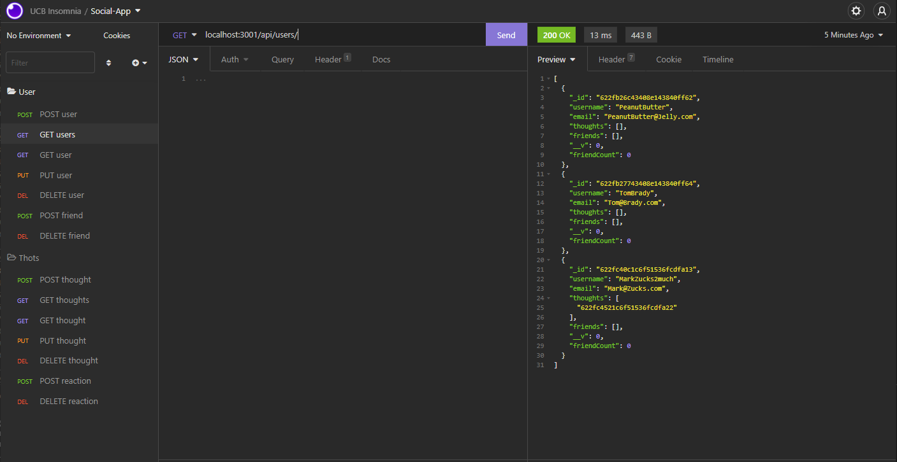

# Social Network

## Description

This project displays the user's knowledge of using NoSQL, MongoDB, and compilation of models, routes, and controllers.

## Demo

[Video Demo](https://drive.google.com/file/d/1gVUXXba8JkkJtMWnyzu67EkR80Xek0np/view?usp=sharing)

## Built With

 

## Table of Contents

- [Installation](#Installation)
- [License](#License)

## Installation

Users should run `npm install` to properly install necessary packages.

## License

### &copy; 2022 Charlton H
